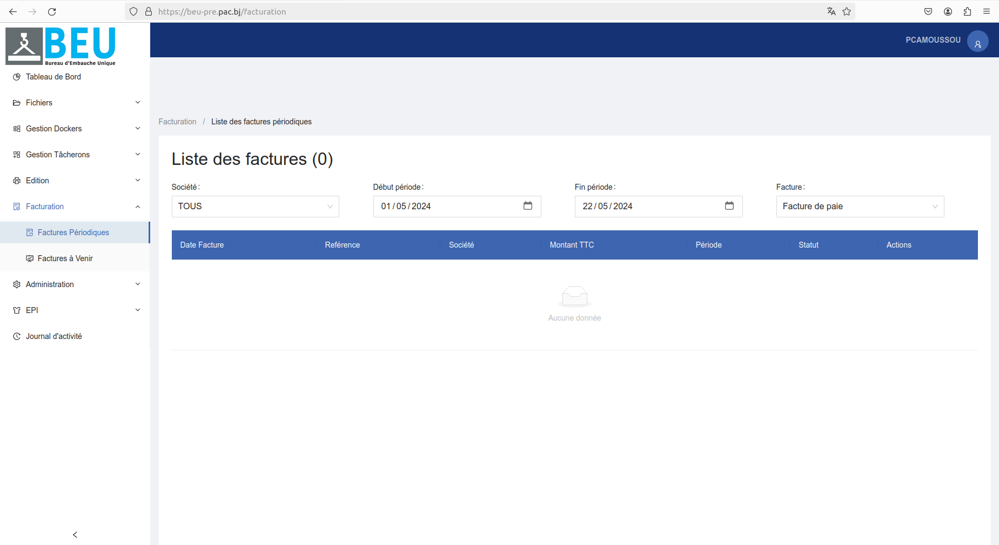

# Facturation

## Liste des demandes de tâcherons

Cette section permet de consulter et rechercher la liste complète des demandes de tâcherons enregistrées dans le système. Chaque ligne du tableau contient les informations suivantes :

-Référence
-Création
-Navire
-Chantier
-Opération
-Demandeur
-N° Conteneur 
-Produit
-Quantité
-Statut
-Actions

### Filtres de recherche

Plusieurs filtres sont disponibles pour faciliter la recherche d'une demande de tâcheron spécifique : Cliquer sur le bouton "Cliquez ici pour faire une recherche avancée" pour rechercher.

- **Référence** : Rechercher par le numéro de demande.
- **Nature Opération** : Rechercher par le type d'opération.
- **Début période** : Rechercher par la date de début.
- **Fin période** : Rechercher par la date de fin.

### Résultats

La liste affiche les informations suivantes pour chaque tâcheron:
- **Référence** : Le numéro de demande attribué.
- **Nature Opération** : La nature de l'opération.
- **Date début prévu** : La date de début prévu.
- **Date fin prévu** : La date de fin prévu.

## Modifier une demande de tâcheron 
Pour modifier les informations d'une demande de tâcheron, cliquez sur le bouton "Modifier" et changer les informations au niveau des champs du formulaire voulu.
Une fois les modifications apportées, cliquez sur "Mettre à jour" pour enregistrer les changements.

### Suppression d'une demande de tâcheron
Pour supprimer une demande de tâcheron :
1. Cliquez sur le bouton Annuler (avec une icône de poubelle) situé dans la colonne "Actions" de la ligne correspondant à la demande de tâcheron que vous souhaitez supprimer.
2. Une confirmation peut être demandée.
3. La demande de tâcheron sera supprimée de la liste.

## Liste des demandes de tâcherons en attente

La page de liste des demandes Dockers affiche toutes les demandes Dockers en attente dans un tableau. Chaque ligne du tableau contient les informations suivantes :
-Référence
-Création
-Navire
-Chantier
-Opération
-Demandeur
-N° Conteneur 
-Produit
-Quantité
-Statut
-Actions

### Filtres de recherche

Plusieurs filtres sont disponibles pour faciliter la recherche d'une demande de tâcheron en attente : Cliquer sur le bouton "Cliquez ici pour faire une recherche avancée" pour rechercher.

- **Référence** : Rechercher par la référence.
- **Société** : Rechercher par le nom de la société.
- **Navire** : Rechercher par le nom du navire.
- **Début période** : Rechercher par la date de début.
- **Fin période** : Rechercher par la date de fin.
- **Statut** : Rechercher par le statut de la demande.

### Résultats

La liste affiche les informations suivantes pour chaque demande de tâcheron en attente :
- **Références** : Le numéro de demande attribué.
- **Société** : Le nom de la société.
- **Navire** : Le nom du navire. 
- **Début période** : La date de début.
- **Fin période** : La date de fin.
- **Statut** : Le statut de la demande.

