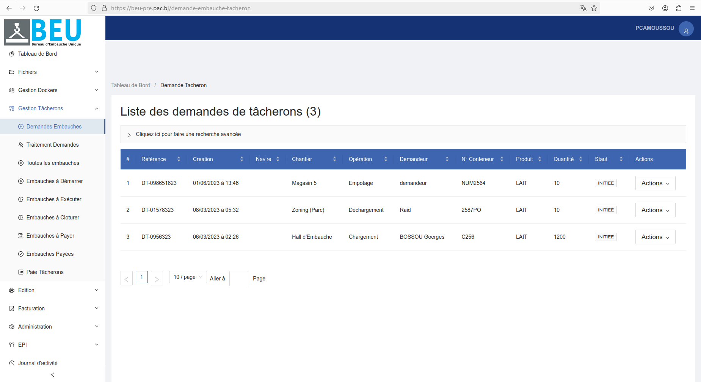

# Gestion Tâcherons

## Liste des demandes de tâcherons

Cette section permet de consulter et rechercher la liste complète des demandes de tâcherons enregistrées dans le système. Chaque ligne du tableau contient les informations suivantes :

-Référence
-Création
-Navire
-Chantier
-Opération
-Demandeur
-N° Conteneur 
-Produit
-Quantité
-Statut
-Actions

### Filtres de recherche

Plusieurs filtres sont disponibles pour faciliter la recherche d'une demande de tâcheron spécifique : Cliquer sur le bouton "Cliquez ici pour faire une recherche avancée" pour rechercher.

- **Référence** : Rechercher par le numéro de demande.
- **Nature Opération** : Rechercher par le type d'opération.
- **Début période** : Rechercher par la date de début.
- **Fin période** : Rechercher par la date de fin.

### Résultats

La liste affiche les informations suivantes pour chaque tâcheron:
- **Référence** : Le numéro de demande attribué.
- **Nature Opération** : La nature de l'opération.
- **Date début prévu** : La date de début prévu.
- **Date fin prévu** : La date de fin prévu.

## Modifier une demande de tâcheron 
Pour modifier les informations d'une demande de tâcheron, cliquez sur le bouton "Modifier" et changer les informations au niveau des champs du formulaire voulu.
Une fois les modifications apportées, cliquez sur "Mettre à jour" pour enregistrer les changements.

### Suppression d'une demande de tâcheron
Pour supprimer une demande de tâcheron :
1. Cliquez sur le bouton Annuler (avec une icône de poubelle) situé dans la colonne "Actions" de la ligne correspondant à la demande de tâcheron que vous souhaitez supprimer.
2. Une confirmation peut être demandée.
3. La demande de tâcheron sera supprimée de la liste.

## Liste des demandes de tâcherons en attente

La page de liste des demandes Dockers affiche toutes les demandes Dockers en attente dans un tableau. Chaque ligne du tableau contient les informations suivantes :
-Référence
-Création
-Navire
-Chantier
-Opération
-Demandeur
-N° Conteneur 
-Produit
-Quantité
-Statut
-Actions

### Filtres de recherche

Plusieurs filtres sont disponibles pour faciliter la recherche d'une demande de tâcheron en attente : Cliquer sur le bouton "Cliquez ici pour faire une recherche avancée" pour rechercher.

- **Référence** : Rechercher par la référence.
- **Société** : Rechercher par le nom de la société.
- **Navire** : Rechercher par le nom du navire.
- **Début période** : Rechercher par la date de début.
- **Fin période** : Rechercher par la date de fin.
- **Statut** : Rechercher par le statut de la demande.

### Résultats

La liste affiche les informations suivantes pour chaque demande de tâcheron en attente :
- **Références** : Le numéro de demande attribué.
- **Société** : Le nom de la société.
- **Navire** : Le nom du navire. 
- **Début période** : La date de début.
- **Fin période** : La date de fin.
- **Statut** : Le statut de la demande.

## Liste des demandes de tâcherons

La page de liste des demandes de tâcherons affiche toutes les demandes de tâcherons existantes dans un tableau. Chaque ligne du tableau contient les informations suivantes :
-Référence
-Création
-Navire
-Chantier
-Opération
-Demandeur
-N° Conteneur 
-Produit
-Quantité
-Statut

### Embauches à Démarrer

Cette section affiche la liste des demandes de tâcherons.

#### Filtres de recherche

Plusieurs filtres sont disponibles pour faciliter la recherche d'une demande de tâcheron :

- **Références** : Rechercher par le numéro de demande.
- **Société** : Rechercher par le nom de la société.
- **Navire** : Rechercher par le nom du navire.
- **Chantier** : Rechercher par le nom du chantier.
- **Opération** : Rechercher par le type d'opération.
- **Début période** : Rechercher par la date de début.
- **Fin période** : Rechercher par la date de fin.

#### Résultats

La liste affiche les informations suivantes pour chaque demande de tâcheron :

- **Références** : Le numéro de demande attribué.
- **Société** : Le nom de la société.
- **Navire** : Le nom du navire.
- **Chantier** : Le nom du chantier.
- **Opération** : Le type d'opération.
- **Début période** : La date de début.
- **Fin période** : La date de fin.
- **Actions** : Un bouton d'action permettant de démarrer l'embauche.

### Embauches à Exécuter

Cette section affiche la liste des embauches de tâcheron qui sont prêtes à être exécutées.

#### Filtres de recherche

Plusieurs filtres sont disponibles pour faciliter la recherche d'une embauche de tâcheron à exécuter :

- **Références** : Rechercher par le numéro de demande.
- **Société** : Rechercher par le nom de la société.
- **Début période** : Rechercher par la date de début.
- **Fin période** : Rechercher par la date de fin.

#### Résultats

La liste affiche les informations suivantes pour chaque embauche de tâcheron à exécuter :

- **Références** : Le numéro de demande attribué.
- **Société** : Le nom de la société.
- **Début période** : La date de début.
- **Fin période** : La date de fin.

### Embauches à Clôturer

Cette section affiche la liste des embauches de tâcherons qui sont prêtes à être clôturées.

#### Filtres de recherche  

Plusieurs filtres sont disponibles pour faciliter la recherche d'une embauche de tâcheron à clôturer :

- **Références** : Rechercher par le numéro de demande.
- **Société** : Rechercher par le nom de la société.
- **Navire** : Rechercher par le nom du navire.
- **Chantier** : Rechercher par le nom du chantier.
- **Opération** : Rechercher par le type d'opération. 
- **Début période** : Rechercher par la date de début.
- **Fin période** : Rechercher par la date de fin.

#### Résultats

La liste affiche les informations suivantes pour chaque embauche de tâcheron à clôturer :

- **Références** : Le numéro de demande attribué.
- **Société** : Le nom de la société.
- **Navire** : Le nom du navire.
- **Chantier** : Le nom du chantier.
- **Opération** : Le type d'opération.
- **Début période** : La date de début. 
- **Fin période** : La date de fin.
- **Actions** : Un bouton d'action permettant de clôturer l'embauche.

### Embauches à Payer

Cette section affiche la liste des embauches de tâcherons qui sont prêtes à être payées.

#### Filtres de recherche

Plusieurs filtres sont disponibles pour faciliter la recherche d'une embauche à payer :

- **Références** : Rechercher par le numéro de demande.
- **Société** : Rechercher par le nom de la société.
- **Navire** : Rechercher par le nom du navire.
- **Chantier** : Rechercher par le nom du chantier.
- **Opération** : Rechercher par le type d'opération.
- **Début période** : Rechercher par la date de début.
- **Fin période** : Rechercher par la date de fin.

#### Résultats

La liste affiche les informations suivantes pour chaque embauche de tâcheron à payer :

- **Références** : Le numéro de demande attribué.
- **Société** : Le nom de la société. 
- **Navire** : Le nom du navire.
- **Chantier** : Le nom du chantier.
- **Opération** : Le type d'opération.
- **Début période** : La date de début.
- **Fin période** : La date de fin.
- **Montant** : Le montant total à payer pour l'embauche.

### Embauches Payées  

Cette section affiche la liste des embauches de tâcherons qui ont été payées.

#### Filtres de recherche

Plusieurs filtres sont disponibles pour faciliter la recherche d'une embauche de tâcheron déjà payée :

- **Références** : Rechercher par le numéro de demande.
- **Société** : Rechercher par le nom de la société.
- **Navire** : Rechercher par le nom du navire.
- **Chantier** : Rechercher par le nom du chantier.
- **Opération** : Rechercher par le type d'opération.
- **Début période** : Rechercher par la date de début.
- **Fin période** : Rechercher par la date de fin.
- **Date de paiement** : Rechercher par la date de paiement.

#### Résultats

La liste affiche les informations suivantes pour chaque embauche payée :

- **Références** : Le numéro de demande attribué.
- **Société** : Le nom de la société.
- **Navire** : Le nom du navire.
- **Chantier** : Le nom du chantier.
- **Opération** : Le type d'opération. 
- **Début période** : La date de début.
- **Fin période** : La date de fin.
- **Montant** : Le montant total payé pour l'embauche.
- **Date de paiement** : La date à laquelle l'embauche a été payée.

### Paie Docker

Cette section permet de gérer la paie des tâcherons embauchés.

#### Filtres de recherche

Plusieurs filtres sont disponibles pour faciliter la recherche :

- **Nom** : Rechercher par le nom du tâcheron.
- **Prénom** : Rechercher par le prénom du tâcheron.
- **Période de paie** : Rechercher par la période de paie.

#### Résultats

La liste affiche les informations suivantes pour chaque tâcheron :

- **Nom** : Le nom du tâcheron.
- **Prénom** : Le prénom du tâcheron.
- **Heures travaillées** : Le nombre d'heures travaillées pendant la période.
- **Taux horaire** : Le taux horaire du tâcheron.
- **Montant dû** : Le montant total à payer au tâcheron pour la période.
- **Actions** : Un bouton d'action permettant de procéder au paiement du tâcheron.